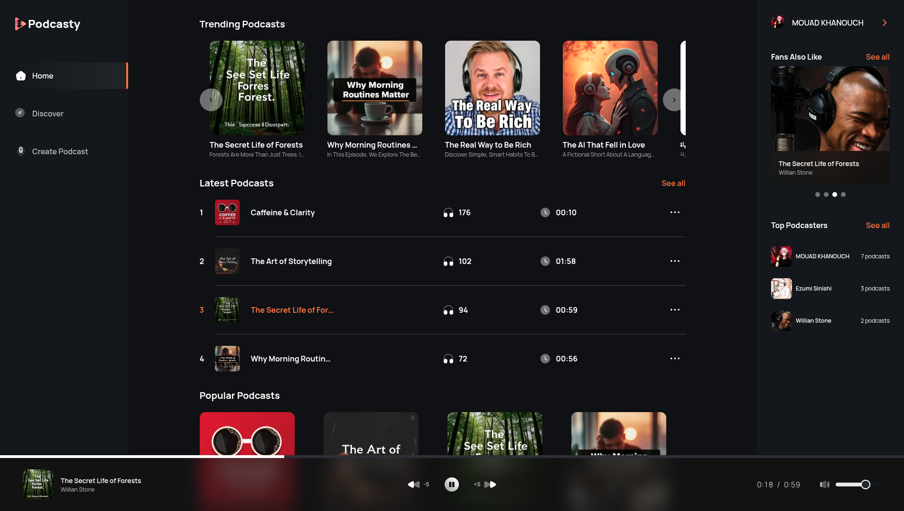

# Podcasty - Podcast Streaming Application



Podcasty is a modern podcast streaming platform that allows users to discover, listen to, and share their favorite podcasts. The app includes a powerful text-to-speech functionality, allowing users to convert written text into fully playable podcast episodes.
Built with cutting-edge technologies like Next.js, MongoDB, and Cloudinary, Podcasty offers a seamless and engaging listening experience with robust features like audio playback, podcast management, text-to-speech conversion, and user profiles.

---

## 🚀 Features

### 🎙️ Core Features

- User authentication with Clerk
- Text-to-speech conversion for generating podcasts from text
- Podcast streaming with a custom audio player
- Podcast creation, editing, and deletion
- User profiles with listening history
- Fully responsive design

### 🎧 Audio Features

- Custom audio player controls
- Background audio persistence

### 📱 Content Management

- Upload podcasts with images and audio
- Edit podcast details and metadata
- Delete podcasts (with Cloudinary media cleanup)
- View podcast analytics (plays, duration)

---

## 🛠 Technologies Used

### Frontend

- [Next.js 14 (App Router)](https://nextjs.org/)
- [React 18](https://reactjs.org/)
- TypeScript
- Tailwind CSS
- [shadcn/ui](https://ui.shadcn.com/)
- Zod (form validation)

### Backend

- Next.js API Routes with server actions
- Mongoose (MongoDB ODM)
- Cloudinary (media storage)
- Clerk (authentication)

### Database

- MongoDB (via MongoDB Atlas)

---

## ⚙️ Getting Started

### Prerequisites

- Node.js 18+
- MongoDB Atlas account
- Cloudinary account
- Clerk account

### Installation

1. **Clone the repository:**

```bash
git clone https://github.com/MD-MOUAD/podcasty.git
cd podcasty
```

2. **Install dependencies:**

```bash
npm install
```

3. **Set up environment variables:**
   Create a `.env.local` file in the root directory with the following:

```env
MONGODB_URI=your_mongodb_connection_string
CLOUDINARY_CLOUD_NAME=your_cloudinary_cloud_name
CLOUDINARY_API_KEY=your_cloudinary_api_key
CLOUDINARY_API_SECRET=your_cloudinary_api_secret
NEXT_PUBLIC_CLERK_PUBLISHABLE_KEY=your_clerk_publishable_key
CLERK_SECRET_KEY=your_clerk_secret_key
CLERK_WEBHOOK_SIGNING_SECRET
NEXT_PUBLIC_CLERK_FRONTEND_API_URL
NEXT_PUBLIC_CLERK_SIGN_IN_URL=/sign-in
NEXT_PUBLIC_CLERK_SIGN_UP_URL=/sign-up
NEXT_PUBLIC_CLERK_AFTER_SIGN_IN_URL=/
NEXT_PUBLIC_CLERK_AFTER_SIGN_UP_URL=/

ELEVENLABS_API_KEY=your_text_to_speech_api
```

4. **Run the development server:**

```bash
npm run dev
```

Open [http://localhost:3000](http://localhost:3000) in your browser.

---

## 📁 Project Structure

```
podcasty/
├── app/
│   ├── (auth)/               # Authentication routes
│   ├── (root)/               # Main application routes
│   └── api/                  # API routes
├── components/               # Reusable components
├── constants/                # Application constants
├── hooks/                    # Custom React hooks
├── lib/
│   ├── actions/              # Server actions
│   ├── models/               # Database models
│   └── utils                 # Helper functions
├── providers/                # Context providers
├── public/                   # Static assets
└── types/                    # TypeScript type definitions
```

---

## 🔌 API Endpoints

### Test-To-Speech

- `POST /api/tts` - post get ai audio from text prompt

---

## 🚀 Deployment

You can deploy Podcasty on [Vercel](https://vercel.com/) with ease:

Live App: [https://podcasty-rust.vercel.app](https://podcasty-rust.vercel.app)

1. Push your code to GitHub
2. Create a new project on Vercel
3. Connect your GitHub repository
4. Add your environment variables in the Vercel dashboard
5. Click **Deploy**

[](https://vercel.com/import)

---

## 🤝 Contributing

We welcome contributions from the community!

1. Fork the repository
2. Create a new branch: `git checkout -b feature/your-feature`
3. Commit your changes: `git commit -m 'Add some feature'`
4. Push to your branch: `git push origin feature/your-feature`
5. Open a Pull Request

---

## 📄 License

This project is licensed under the MIT License. See the [LICENSE](LICENSE) file for details.

---

## 📬 Contact

**Mouad Khanouch**
Email: [mouadmouadkhanouch@gmail.com](mailto:mouadmouadkhanouch@gmail.com)
GitHub: [https://github.com/MD-MOUAD/podcasty](https://github.com/MD-MOUAD/podcasty)
